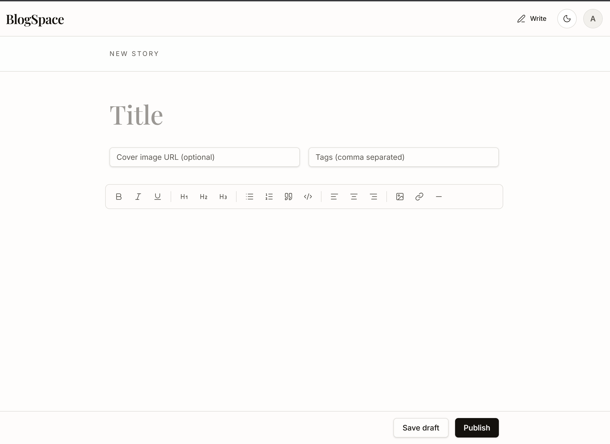
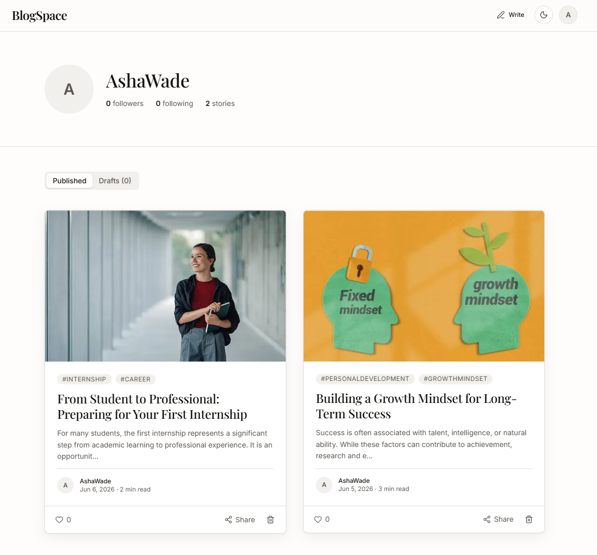

# BlogSpace

[](https://react.dev/)
[](https://www.typescriptlang.org/)
[](https://nodejs.org/)
[](https://expressjs.com/)
[](https://www.mongodb.com/atlas)
[](LICENSE)

BlogSpace is a full-stack publishing platform for writers and readers who value thoughtful long-form content. It combines a polished React reading experience, a rich text writing workflow, authenticated user profiles, and a production-style Express API backed by MongoDB.

The project exists to demonstrate modern full-stack engineering practices in a portfolio-ready application: clean UI architecture, REST API design, authentication, content workflows, database modeling, validation, and deployable frontend/backend separation.

## Features

### Reading and Discovery

- Editorial home feed with responsive post cards.
- Search across story titles, tags, and writers.
- Explore and following feed modes.
- Article pages with cover images, tags, reading time, author metadata, and share actions.
- Markdown/HTML rendering support for rich article content.
- Loading skeletons, empty states, retry states, and responsive layouts.

### Writing and Publishing

- TipTap-powered rich text editor.
- Formatting controls for headings, bold, italic, underline, lists, quotes, code blocks, alignment, links, images, and dividers.
- Post metadata fields for title, cover image, and tags.
- Draft saving, draft management, and publish flow.
- Owner-only edit/delete workflows for content management.

### Accounts and Social Features

- Email/password authentication with JWT-backed API sessions.
- Profile onboarding with name, username, bio, and avatar.
- Public writer profiles with published stories and profile statistics.
- Follow/unfollow interactions.
- Like/unlike interactions with persisted counts.
- Theme switching with persisted preference.

### Engineering Highlights

- Type-safe frontend domain models with React and TypeScript.
- File-based routing with TanStack Router.
- Local client state with Zustand.
- Centralized Axios API client with auth token injection.
- Express 5 REST API organized by routes, controllers, services, models, middleware, and validators.
- Zod request and environment validation.
- Mongoose schemas with indexes, hooks, ownership checks, and denormalized counters.
- Security and operational middleware including Helmet, CORS, Morgan, and centralized error handling.

## Screenshots

| Home | Editor |
| --- | --- |
|  |  |

| Article | Profile |
| --- | --- |
|  |  |

## Tech Stack

| Area | Technologies |
| --- | --- |
| Frontend | React 19, TypeScript, Vite, TanStack Router, Tailwind CSS, Radix UI, TipTap, Zustand, Axios, Framer Motion, Sonner, Lucide React |
| Backend | Node.js, Express 5, JWT, bcryptjs, Zod, Helmet, CORS, Morgan, Multer, Cloudinary |
| Database | MongoDB Atlas, Mongoose |
| Deployment | Frontend static/app hosting, Node.js API hosting, MongoDB Atlas, environment-based configuration |

## Architecture

```text
User
│
▼
React Frontend
│
▼
Express REST API
│
▼
MongoDB Atlas
```

BlogSpace separates the client and API into two deployable layers. The React app handles routing, editor interactions, authentication state, and UI composition. The Express API owns authentication, validation, authorization, content persistence, social relationships, uploads, and database access through Mongoose models.

## Project Structure

```text
BlogSpace/
|-- src/
|   |-- components/          # Reusable UI and product components
|   |-- hooks/               # Frontend data and state hooks
|   |-- lib/                 # API client, markdown, formatting, utilities
|   |-- routes/              # TanStack Router pages
|   |-- services/            # Frontend API service functions
|   |-- store/               # Zustand stores
|   |-- types/               # TypeScript domain types
|   |-- router.tsx           # Router setup
|   |-- styles.css           # Tailwind theme and global styles
|-- backend/
|   |-- src/
|   |   |-- config/          # Environment, database, and service config
|   |   |-- controllers/     # HTTP request handlers
|   |   |-- middleware/      # Auth, validation, upload, and error middleware
|   |   |-- models/          # Mongoose schemas
|   |   |-- routes/          # Express route modules
|   |   |-- services/        # Business logic and data workflows
|   |   |-- utils/           # Backend helper utilities
|   |   |-- validators/      # Zod validation schemas
|   |   |-- app.js           # Express app configuration
|   |   |-- server.js        # Server lifecycle and database connection
|   |-- .env.example
|   |-- package.json
|-- docs/
|   |-- screenshots/         # README screenshots
|-- LICENSE
|-- package.json
|-- tsconfig.json
|-- vite.config.ts
```

## Getting Started

### Prerequisites

- Node.js 20 or newer
- npm
- MongoDB Atlas connection string or a local MongoDB instance
- Cloudinary credentials for image upload support

### Frontend Setup

```bash
git clone <repository-url>
cd BlogSpace
npm install
npm run dev
```

The frontend runs locally at:

```text
http://localhost:5173
```

Create a root `.env.local` file when connecting the frontend to the local API:

```env
VITE_API_URL=http://localhost:5000/api
```

### Backend Setup

```bash
cd backend
npm install
cp .env.example .env
npm run dev
```

On Windows PowerShell, create the backend environment file with:

```powershell
Copy-Item .env.example .env
```

The backend runs locally at:

```text
http://localhost:5000
```

Health check:

```bash
curl http://localhost:5000/api/health
```

### Environment Variables

Backend variables are defined in `backend/.env.example`.

| Variable | Purpose |
| --- | --- |
| `NODE_ENV` | Runtime environment: `development`, `test`, or `production`. |
| `PORT` | Backend API port. Defaults to `5000`. |
| `MONGO_URI` | MongoDB connection string. |
| `CORS_ORIGIN` | Allowed frontend origin, for example `http://localhost:5173`. |
| `JWT_SECRET` | Secret used to sign access tokens. Must be at least 32 characters. |
| `JWT_EXPIRES_IN` | Access token lifetime, for example `7d`. |
| `CLOUDINARY_CLOUD_NAME` | Cloudinary cloud name for image uploads. |
| `CLOUDINARY_API_KEY` | Cloudinary API key. |
| `CLOUDINARY_API_SECRET` | Cloudinary API secret. |

## API Overview

The API is mounted under `/api` and returns JSON responses using a consistent success/data envelope.

| Method | Endpoint | Description | Auth |
| --- | --- | --- | --- |
| `GET` | `/health` | API health check. | No |
| `POST` | `/auth/signup` | Create an account. | No |
| `POST` | `/auth/login` | Authenticate a user. | No |
| `GET` | `/auth/me` | Return the current user. | Yes |
| `GET` | `/posts` | List published posts with pagination and filters. | Optional |
| `GET` | `/posts/:id` | Get a post by ID or slug. | Optional |
| `POST` | `/posts` | Publish a new post. | Yes |
| `PATCH` | `/posts/:id` | Update an owned post. | Yes |
| `DELETE` | `/posts/:id` | Delete an owned post. | Yes |
| `POST` | `/posts/:id/like` | Like a post. | Yes |
| `DELETE` | `/posts/:id/like` | Unlike a post. | Yes |
| `GET` | `/drafts` | List the current user's drafts. | Yes |
| `POST` | `/drafts` | Save a draft. | Yes |
| `PATCH` | `/drafts/:id` | Update an owned draft. | Yes |
| `DELETE` | `/drafts/:id` | Delete an owned draft. | Yes |
| `POST` | `/drafts/:id/publish` | Publish a draft as a post. | Yes |
| `GET` | `/users/:username` | Get a public writer profile. | Optional |
| `PATCH` | `/users/me` | Update the current user's profile. | Yes |
| `POST` | `/users/:id/follow` | Follow a writer. | Yes |
| `DELETE` | `/users/:id/follow` | Unfollow a writer. | Yes |
| `POST` | `/uploads/image` | Upload an image. | Yes |

## Deployment

### Frontend

Build the frontend from the repository root:

```bash
npm run build
```

Deploy the built frontend to a modern frontend hosting provider. Configure `VITE_API_URL` with the production API URL before building.

### Backend

Deploy the backend as a Node.js service from the `backend/` directory:

```bash
npm start
```

Required production configuration:

- `MONGO_URI` points to a MongoDB Atlas cluster.
- `JWT_SECRET` is a strong production secret.
- `CORS_ORIGIN` is restricted to the deployed frontend domain.
- Cloudinary variables are configured when image uploads are enabled.

## Future Enhancements

- Add automated unit, integration, and end-to-end test coverage.
- Add GitHub Actions for linting, builds, and backend checks.
- Add editor autosave and revision history.
- Add comments, bookmarks, and reading lists.
- Add profile settings for account and notification preferences.
- Add analytics for author dashboards and post performance.
- Add OpenAPI documentation for the REST API.

## License

BlogSpace is released under the [MIT License](LICENSE).

## Author

Created and maintained by **Pratham Mishra**.